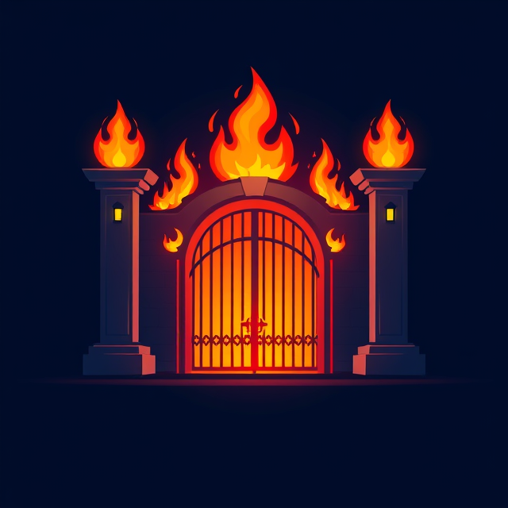

# Fire Gate

With the Fire Gate Discord app is it possible to communicatie anonymously with other Discord users. The only limitation is that users can only communicatie with other users who have this app in common.

## Spirits
People can communicate with each other through entities known as spirits. Everyone can create an unlimited amount of spirits and the owners of these spirits remain anonymous. These spirits go trough the [Fire Gate](./resources/markdown/documentation.md#fire-gate) or gather at [custom made gates](./resources/markdown/documentation.md#custom-gates).

