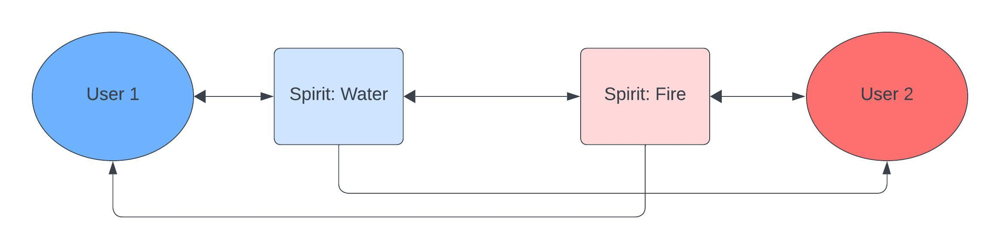

# Fire Gate
With the Fire Gate Discord app is it possible to communicatie anonymously with other Discord users. The only limitation is that users can only communicatie with other users who have this app in common.

## Example
People can communicate with each other through spirits. Everyone can create an unlimited amount of spirits and no-one knows the owners of the spirits. Spirits gather at custom made gates or go trough the Fire Gate.

### Fire Gate
`User 1` can talk with `User 2` trough the owned spirit `Water`. The spirit `Water` can directly message `User 2`. `User 2` can respond by creating their own spirit, in this case the spirit is called `Fire`. The spirit `Fire` is capable of messaging the spirit `Water`, the spirit `Water` can directly reply to the `Fire` spirit. In this case `User 1` knows that the spirit `Fire` comes from `User 2`, because `User 2` replied using the `Fire` spirit, but `User 2` doesn't know the `Water` spirit is from `User 1`. It's possible to stay both anonymous if you don't make it obvious who's spirit it is from.

