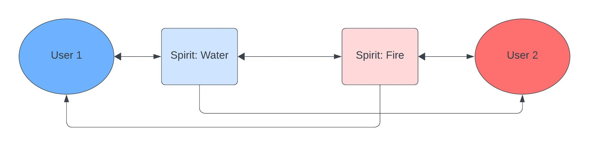
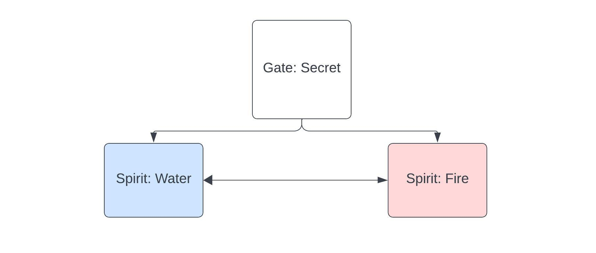

# Documentation
### Fire Gate
The Fire Gate is way for people to communicate with each other. For instance, `User 1` can talk with `User 2` by using their spirit named `Water`. The spirit `Water` can directly message `User 2`. `User 2` can respond by creating their own spirit, in this case the spirit is named `Fire`. The spirit `Fire` sends a message to the spirit `Water`, which can then directly respond to it.

In this scenario `User 1` knows that the spirit `Fire` belongs to `User 2`, because `User 2` replied using the `Fire` spirit, but `User 2` doesn't know the `Water` spirit is from `User 1`. It's possible to stay both anonymous if you don't make it obvious who's spirit it is from.

### Custom gates
People can also communicate with each other trough custom gates. You can create a gate and open it using a spirit. Other users can also open the same gate with their spirits, allowing interactions between spirits within the gate. You can see it as a group chat.

In this case the gate is called `Secret` and contains the spirits `Water` and `Fire`.

